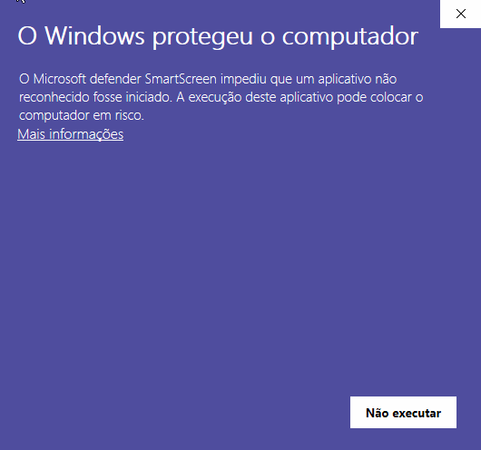

# Script de Instalação do Python e Pacotes para Automação :fire: 

---

Este é um script básico em lote para o Windows que faz download e a instalação da última versão do Python, e instala as bibliotecas para automação como Selenium, PyAutoGUI e MouseInfo.

### Pré-requisitos
- Sistema operacional Windows 10
- Conexão com a internet

### Instalação

Clone o repositório ou copie o script para sua máquina local
Clique duas vezes no script para executá-lo.

### Uso 

Basta executar o script para verificar se os pacotes requeridos estão instalados. Se  não estiverem instalados, o script fará o download e a instalação. Se eles já estiverem instalados, o script imprimirá uma mensagem indicando que já estão instalados.

:warning: Ao clicar no script.bat, talvez seja necessário clicar em "Executar assim mesmo".




Depois da instalação do arquivo script.bat, rode esse comando dentro do cmd  :

```
python teste_script.py
```

:thinking:  Lembre-se de estar dentro do diretório que contém os arquivos baixados para verificar se a instalação está funcionando corretamente.


### Contribuições
Se você encontrar algum bug ou tiver sugestões de melhoria, sinta-se à vontade para abrir uma issue ou pull request no repositório.
